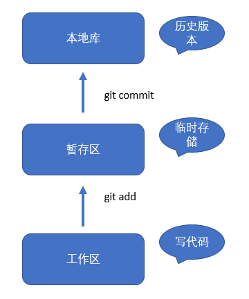
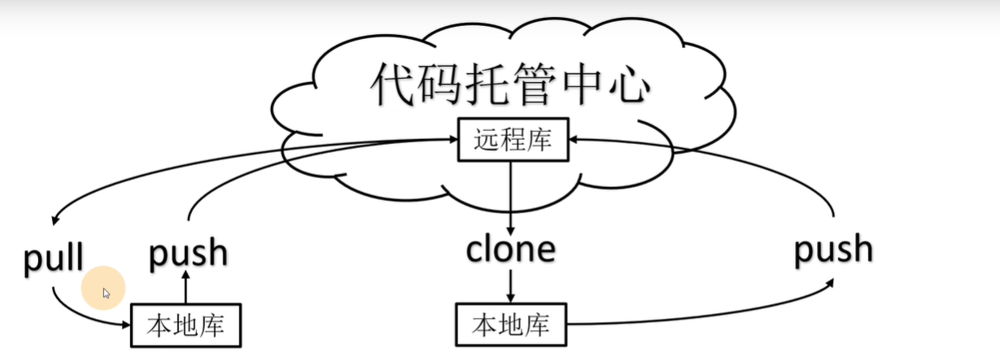
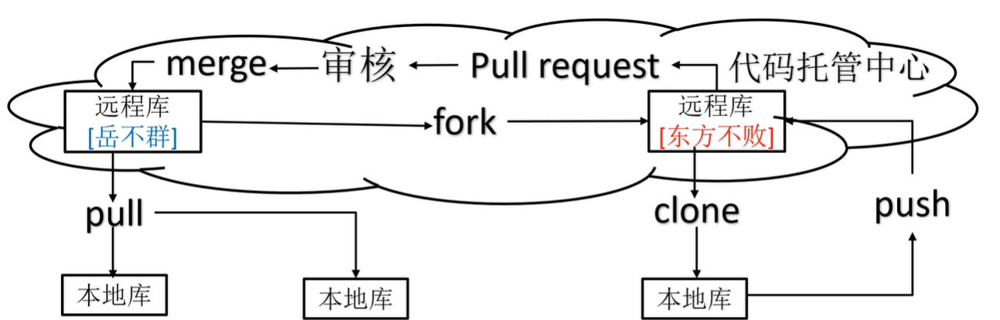

### Git 介绍
分布式版本控制工具

Git分支 分支特性 分支创建 分支转换 分支合并 代码合并冲突解决

### Git 工作机制

### Git 常用命令
| command                                | 作用             |
| -------------------------------------- | ---------------- |
| git config --global user.name username | 本地用户签名     |
| git config --global user.email email   | 本地用户邮箱     |
| git init                               | 初始化本地库     |
| git add <file>                         | 添加file至暂存区 |
| git rm --cached <file>                 | 在暂存中除去file |
| git commit -m "msg" <file>             | 提交file         |
| git status                             |                  |
| git reflog                             |                  |
| git log                                |                  |
| git reset --hard <版本号>              |                  |

#### git add
Summary:

`git add -A` stages all changes

`git add .` stages new files and modifications, without deletions (on the current directory and its subdirectories).

`git add -u` stages modifications and deletions, without new files

Detail:

`git add -A` is equivalent to `git add .`; `git add -u`.

The important point about `git add .` is that it looks at the working tree and adds all those paths to the staged changes if they are either changed or are new and not ignored, it does not stage any 'rm' actions.

`git add -u` looks at all the already tracked files and stages the changes to those files if they are different or if they have been removed. It does not add any new files, it only stages changes to already tracked files.

`git add -A` is a handy shortcut for doing both of those.

### Git 分支操作
| 命令名称            | 作用                         |
| ------------------- | ---------------------------- |
| git branch 分支名   | 创建分支                     |
| git branch -v       | 查看分支                     |
| git checkout 分支名 | 切换分支                     |
| git merge 分支名    | 把指定的分支合并到当前分支上 |

## Git 团队协作

## 创建远程仓库别名
| git remote -v                | 查看当前所有远程地址别名 |
| ---------------------------- | ------------------------ |
| git remote add 别名 远程地址 |                          |
| git push 别名 分支           |                          |
| git pull 别名 分支           |                          |
| git clone 远程地址           |