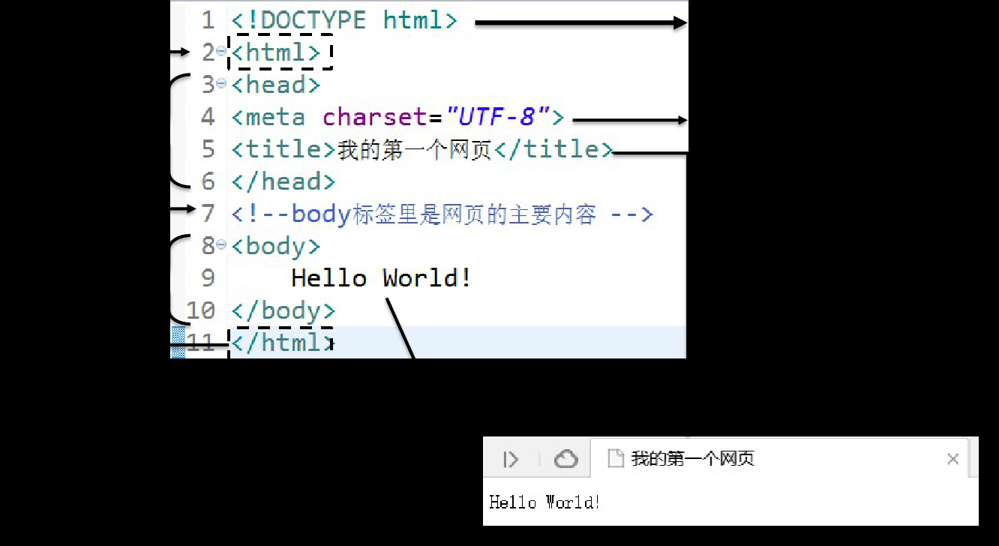
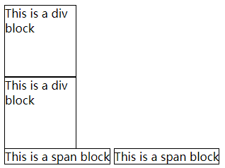
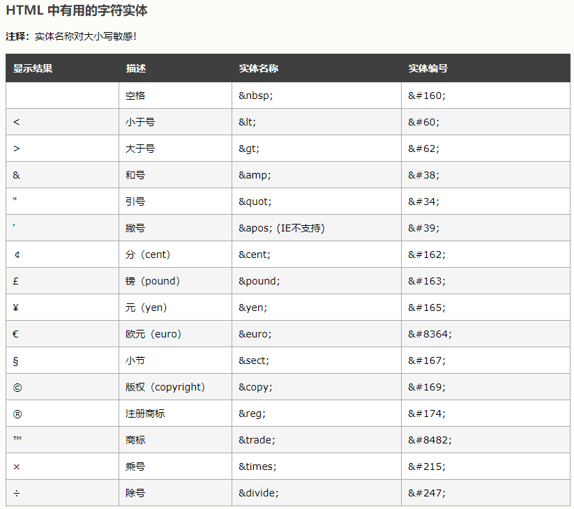

# HTML

## 基础标签

``` html
<html>
    <head>
        <title>标题</title>
        <meta charset="UTF-8">
    </head>
    <body>
        contents<br/>内容
        <p>paragraph</p>
        
    </body>
    <h1>head1</h1>
    <h6>head6</h6>

    <ol type="A" start="1">
        <li>list1</li>
    </ol>
</html>

<!--
    attention:
        meta;
        <br/>
        alt;
        ol: 有序列表，start表示从*开始，type： A a I i 1(default)
        ul: 无序列表，type: disc(default), circle, square
        <b></b>
        <i></i>
        <u></u>
        <sub></sub>
        <sup></sup>
        html entities:
            &lt
            &gt
            &le
            &ge
            <span></span>
            <a href="..." target="">  target: _self,_blank,_parent,_top
-->

## table标签

tr row
td column
th head

* border
* width
* cellspacing
* cellpadding 

tr中属性: align: center, left, right

rowsapn, colspan

``` html
<table border="1" cellspacing="0" cellpadding="4"></table>
<!-- 显示样式的基本已淘汰，还需了解 -->
```

## 表单标签

``` sql
<form action=>"demo.html" method="post">
    nickname: <input type="text" name="nickName" value="enter your nickname"/><br/>
    password: <input type="password" name="pwd"/><br/>
    gender: <input type="radio" name="gender" value="female"/>femal
            <input type="radio" name="gender" value="male"/>male<br/>
    hobbies: <input type="checkbox" name="hobby" value="basketball"/>
    xingzuo: <select name="star">
                <option value="1">baiyang</option>
                <option value="2">baiyang</option>
                <option value="3">baiyang</option>
                <option value="4">baiyang</option>
                <option value="5">baiyang</option>
            </selection><br/>
    comments: <textarea name="remark" rows="4" cols="50"></textarea><br/>
    <input type="submit" value="register"/>
    <input type="reset" value="reset"/>
    <input type="buttion" value="ordinary button"/>
</form>

<!-- input type="text" 表示文本框，其中name属性必须指定，否则这个文本框的数据将来不会发送到服务器>
     input type="radio",name属性保持一致以满足互斥，checked默认选中
     input type="checkbox" 表示复选框。name属性值建议保持一致，这样将来服务器端获取值的时候是一个数组
     select 表示下拉列表。value属性发送给服务器，selected表示默认选中项
     textarea多行文本框，两标签间内容就是其value值。
```


## HTML简介

HTML(Hyper Text Markup language)



### HTML语法规则

* 根标签有且只能有一个
* 无论是双标签还是单标签都必须正确关闭
* 标签可以嵌套但不能交叉嵌套
* 注释不能嵌套
* 属性必须有值，值必须加引号，单引号或双引号均可
* 标签名不区分大小写但建议使用小写

### 使用HTML展示文章

| 标签名称 | 功能                   |
| -------- | ---------------------- |
| h1-h6    | 1级标题-6级标题        |
| p        | 段落                   |
| a        | 超链接                 |
| ul/li    | 无序列表               |
| img      | 图片                   |
| div      | 定义一个前后有换行的块 |
| span     | 定义一个前后无换行的块 |

#### 标题标签

```html
<!DOCTYPE html>
<html lang="en">
<head>
    <meta charset="UTF-8">
    <title>Title</title>
</head>
<body>

    <h1>这是一级标题</h1>
    <h2>这是二级标题</h2>
    <h3>这是三级标题</h3>
    <h4>这是四级标题</h4>
    <h5>这是五级标题</h5>
    <h6>这是六级标题</h6>

</body>
</html>
```

**注意**：标题标签前后有换行。

#### 段落标签

**注意**：段落标签前后有换行。

#### 超链接

```html
<a href="page02-anchor-target.html">点我跳转到下一个页面</a>
```

#### 换行

<br/>

#### 无序列表

```html
    <ul>
        <li>Apple</li>
        <li>Banana</li>
        <li>Grape</li>
    </ul>
```

#### 图片

```html

```
#### 块

```html
<div style="border: 1px solid black;width: 100px;height: 100px;">This is a div block</div>
<div style="border: 1px solid black;width: 100px;height: 100px;">This is a div block</div>

<span style="border: 1px solid black;width: 100px;height: 100px;">This is a span block</span>
<span style="border: 1px solid black;width: 100px;height: 100px;">This is a span block</span>
```

页面显示效果为：



#### HTML entities




