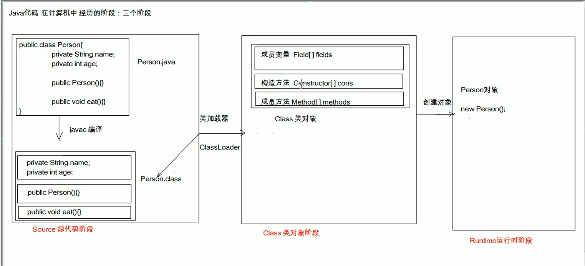

## 反射

#### 反射概述

* 反射：将类的各个组成部分封装为其他对象。
* 好处：
* 1. 可以在程序运行过程中，操作这些对象；
* 2. 可以解耦，提高程序的可扩展性。 



* 获取对象的方式：
  1. Class.forName("全类名")：将字节码文件加载进内存，返回Class对象
     * ```Class class = Class.forName("全类名");```
     * 多用于配置文件
  2. 类名.class：通过类名的属性class获取
      * 多用于参数的传递
  3. 对象.getClass()：getClass()方法在Object类中定义。
     * 多用于对象的获取字节码的方式

* 结论：
  * 同一个字节码文件(*.class)在一次程序运行过程中，只会被加载一次，不论通过哪种方式获取对象。

* Class对象功能：
  * 获取功能：
      1. 获取成员变量
          * Field[] getFields() // public
          * Field getField(String name) // public
          * Field[] getDeclaredFields()
          * Field getDeclaredField(String name)
      2. 获取构造方法们
           * Constructor<?>[] getConstructors()
           * Constructor<T> getConstructor(class<?>... parameterTypes)
           * Constructor<T> getDeclaredConstructor(class<?>... parameterTypes)
           * Constructor<?> getDeclaredConstructors()
      3. 获取成员方法们
          * Method[] getMethods()
          * Method getMethod(String name, class<?>... parameterTypes)
          * Method[] getDeclaredMethods()
          * Method getDeclaredMethod(String name, class<?>... parameterTypes)
      4. 获取类名
           * String getName()


* Field:
  * operation:
      1. 设置值
         * void set(Object obj, Object value)
      2. 获取值
         * get(Object obj)
      3. 忽略访问权限修饰符的安全检查
          * setAccessible()

* Constructor:
  * 创建对象：
    * T newInstance(Object... initargs)
    * 空参构造创建对象可简化：直接用Class对象的newInstance方法

* Method
  * 执行方法
    * Object invoke(Object obj, Object... args)
  * 获取方法名称：
    * String getName: 获取方法名


[reflect](reflect/com/jy/reflect/ReflectDemo2.java)